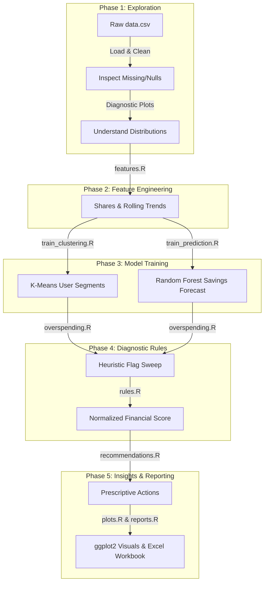

# Consumer Finance MVP — Human Analysis & Modeling Workflow

This document traces the data lifecycle and analytics logic of the platform step-by-step, mimicking the exact workflow a data scientist or financial analyst follows when building, evaluating, and deploying these modules.

---

---

## Phase 1: Raw Data Exploration & Cleaning

When a data scientist first approaches the dataset, they start by loading the raw data structure and examining its baseline characteristics.

### 1. Tabular Structure & Cleaning
We load the raw static CSV (`data.csv`) which contains demographic features (Age, Dependents, Occupation, City Tier) and spending entries across 11 category columns. 
*   **Missing Values**: In the raw loaded CSV, any missing value (`NA`) cells are zero-filled.
*   **Logical Boundaries**: A non-negativity constraint is applied: all spending and income columns are clamped using `pmax(0, val)` to ensure no negative records enter the feature matrices.

### 2. Time-Series Simulation
Because real-world personal finance requires tracking trends, we expand the static entries chronologically over **6 months** per user.
*   **Noise Injection**: Normal noise ($\mu = 1.0, \sigma = 0.05$) is added to variable expenses (Groceries, Transport, Eating Out, Utilities, Healthcare, Miscellaneous, and Income) to simulate real-world budget variance, while keeping fixed expenses (Rent, Loan Repayment, Insurance) static.
*   **Lag Boundary Effects**: Creating rolling lag variables introduces structured boundary `NA` occurrences across the 120,000 generated records:
    *   `prev_expense` & `prev_savings_1`: **20,000 NAs** (month 1 of history lacks prior data).
    *   `prev_savings_2`: **40,000 NAs** (months 1 and 2 lack a 2-month prior snapshot).
    *   `prev_savings_3`: **60,000 NAs** (months 1, 2, and 3 lack a 3-month prior snapshot).
    *   `next_month_savings`: **20,000 NAs** (month 6 is the latest/current month, so its future savings target is not yet observed).

### 3. Understanding Baseline Distributions
Before training any model, we plot distributions to identify user behavior patterns.

#### A. Income Distribution
We plot household income frequencies to understand the demographic bands:

#### B. Savings Rate Distribution
We plot the density of the actual savings rate ($\frac{\text{Surplus}}{\text{Income}}$) to see how many users are operating in a deficit (left of the red dashed line):

#### C. Average Category Consumption
We plot the average monthly consumption across the **11 categories**:

---

## Phase 2: Feature Engineering & Preprocessing

With the clean time-series data, we engineer features that capture monthly spending shares and multi-month trends. This is executed in [features.R](file:///c:/Users/rashi/Desktop/finteach/backend-r/R/features.R) for each user-month:

1.  **Category Shares**: The relative weight of each of the 11 categories:
    $$\text{share} = \frac{\text{category\_spending}}{\text{total\_expense}}$$
2.  **Savings Rate**: The actual performance surplus relative to income.
3.  **Expense Growth**: Month-over-Month growth rate:
    $$\text{expense\_growth} = \frac{\text{total\_expense}_t - \text{total\_expense}_{t-1}}{\text{total\_expense}_{t-1}}$$
4.  **Rolling Average Savings**: Computes the rolling average of actual savings over the previous 3 months.
    *   *Calculation*: $\frac{\text{savings}_{t-1} + \text{savings}_{t-2} + \text{savings}_{t-3}}{3}$
    *   *Fallbacks*: Averages 2 months if only 2 exist, uses 1 if only 1 exists, and defaults to `0` if no prior history is available.
5.  **Rolling Expense Volatility**: Standard deviation of the last 3 months of expenses (`rolling_expense_sd`) to measure spending stability.

---

## Phase 3: Model Selection & Training

Using the engineered feature vectors, we train and configure two types of Machine Learning models.

### 1. User Segmentation (K-Means)
To categorize users into distinct spending styles, we segment them using K-Means clustering.
*   **File**: [clustering.R](file:///c:/Users/rashi/Desktop/finteach/backend-r/R/clustering.R) (Training: [train_clustering.R](file:///c:/Users/rashi/Desktop/finteach/backend-r/scripts/train_clustering.R))
*   **Model**: $K=4$ clustering on 12 scaled features (the 11 category shares + `savings_rate`).
*   **Personas Identified**:
    *   *Balanced Budgeter*: Stable spending, average savings rates.
    *   *High Saver*: Savings rates exceed $25\%$.
    *   *Rent-Burdened User*: Housing share of expenses exceeds $40\%$.
    *   *Entertainment-Heavy Spender*: Discretionary entertainment share exceeds $20\%$.
*   **Standardization**: Centered and scaled using trained parameters from `scaler_params.rds`. Distance to cluster centers is evaluated using Euclidean distance:
    $$\text{Distance} = \sum (x_i - \mu_i)^2$$
*   **Fallback**: If the model files are missing, the system runs a rule-based priority cascade to classify the user.

### 2. Savings Forecasting (Random Forest)
To predict next month's financial outcomes, we fit a regression model.
*   **File**: [prediction.R](file:///c:/Users/rashi/Desktop/finteach/backend-r/R/prediction.R) (Training: [train_prediction.R](file:///c:/Users/rashi/Desktop/finteach/backend-r/scripts/train_prediction.R))
*   **Model**: Random Forest regression of 100 decision trees trained on 16 predictors.
*   **Performance Metrics**: Evaluated on test sets with **$R^2 \approx 0.91$**, **RMSE $\approx \$3509$**, and **MAE $\approx \$1931$**. Top predictors are `Income`, `savings_rate`, and `rent_share`.
*   **Fallback Sequence**: If the Random Forest model fails:
    1.  *Linear Regression*: Fits a linear trend over time using the last 6 months:
        $$\text{savings} = \beta_0 + \beta_1 t + \epsilon$$
    2.  *Surplus constant*: Uses current monthly surplus ($\text{Income} - \text{Expenses}$).

---

## Phase 4: Diagnostic Rules & Financial Scoring

Once the features and projections are computed, the analyst checks them against defined financial health indicators to detect risks.

*   **File**: [overspending.R](file:///c:/Users/rashi/Desktop/finteach/backend-r/R/overspending.R) (Threshold definitions: [rules.R](file:///c:/Users/rashi/Desktop/finteach/backend-r/R/rules.R))
*   **Flags Detected**: The system runs 9 checks:
    *   *Critical*: Spending exceeds income.
    *   *High*: Rent share $> 40\%$, savings rate $< 10\%$, or custom user category thresholds.
    *   *Medium*: Food share $> 30\%$, expense growth $> 20\%$, entertainment share $> 20\%$, or discretionary share $> 40\%$.
    *   *Low*: Transport share $> 25\%$.
*   **Financial Score Formula**:
    $$\text{Score} = 100 - (25 \times N_{\text{Critical}}) - (15 \times N_{\text{High}}) - (10 \times N_{\text{Medium}}) - (5 \times N_{\text{Low}}) + \text{Bonus}$$
    *(A bonus of $+10$ is awarded for actual savings rate $> 20\%$, and $+5$ for rate $> 30\%$. Clamped between $0$ and $100$.)*

---

## Phase 5: Prescriptive Action & Reporting

The final stage of the workflow translates these numerical insights into concrete, visual outputs for end-users and administrators.

### 1. Recommendation Generation
The recommendation engine in [recommendations.R](file:///c:/Users/rashi/Desktop/finteach/backend-r/R/recommendations.R) prioritizes issues into three layers of advice:
*   *Defensive Warnings*: Maps each triggered overspending flag to a specific saving tactic and estimates its monthly dollar savings potential.
*   *Segment-based Optimization*: Provides tailored suggestions for the user's persona (e.g. suggesting investments for High Savers, and dining budget limits for Entertainment Spenders).
*   *Critical Alerts*: Triggers an alert if next-month projected savings fall below zero.

### 2. visual diagnostics
Exposed in [plots.R](file:///c:/Users/rashi/Desktop/finteach/backend-r/R/plots.R), administrators inspect live `ggplot2` graphs to spot system anomalies:
*   *Feature Vector Usage Heatmap*: Plots normalized metrics to isolate outliers.
*   *Persona Distribution Pie Chart*: Monitors the share of users assigned to each segment.
*   *Category Boxplots*: Tracks user spending variance against rules benchmarks.
*   *Score Distribution Density*: Plots histogram curves of calculated user scores.
*   *Projections Trend Line*: Graphs actual historical paths against Random Forest predictions.

### 3. Report Exports
The export engine in [reports.R](file:///c:/Users/rashi/Desktop/finteach/backend-r/R/reports.R) packages the entire workflow into a **5-sheet Excel workbook** using `openxlsx` (Summary, Expenses, Category Breakdown, ML Diagnostics, and Trends) for offline review.
