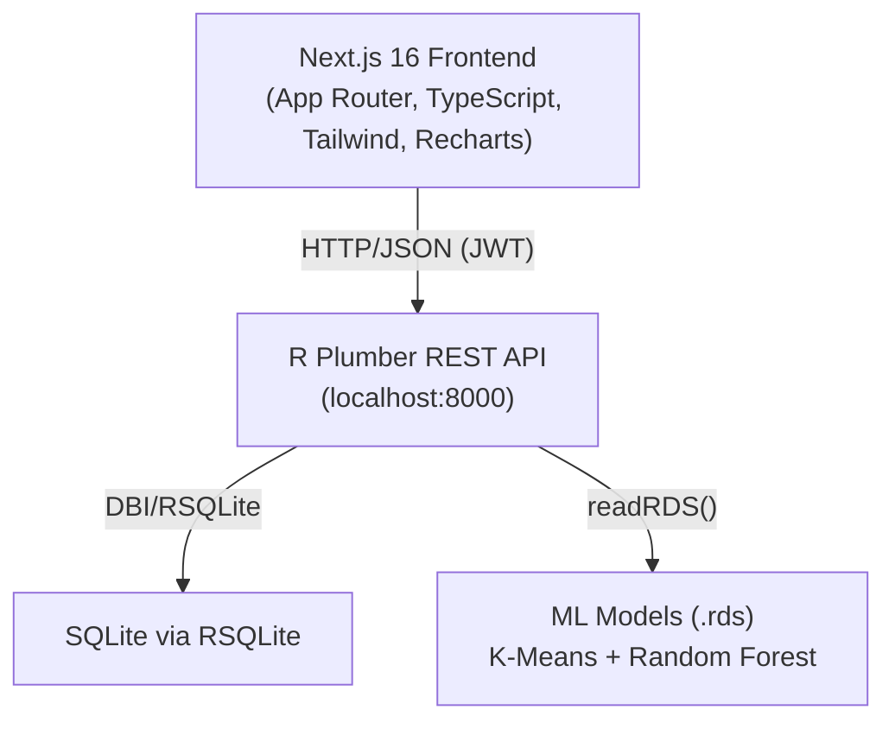
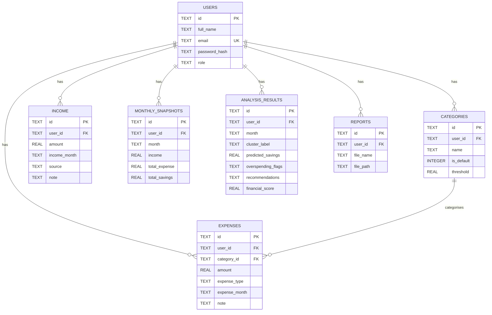

# FinHealth — Full Project Analysis

> **Project:** FinHealth Consumer Finance MVP  
> **Stack:** R 4.6 (Plumber API) + Next.js 16 (App Router) + SQLite  
> **Scope:** Full-stack personal finance platform with ML-powered analysis

---

## 1. Project Architecture



**Monorepo layout:**
- `backend-r/` — R API server (plumber, 15 modules, 1226-line entrypoint)
- `frontend/` — Next.js 16 app (App Router)
- `database/` — canonical `schema.sql` + `seed.sql`
- `scripts/` — PowerShell smoke test

---

## 2. Tech Stack Summary

| Layer | Technology | Notes |
|---|---|---|
| Frontend | Next.js 16.2.4, React 19, TypeScript, Tailwind CSS v4 | App Router, `"use client"` pages |
| UI Library | shadcn/ui, Recharts 3, Lucide React, Sonner | Custom `components/ui/` |
| Backend | R 4.6 + Plumber | Single `plumber.R` entrypoint (1226 lines) |
| Database | SQLite via RSQLite/DBI | WAL mode, FK enforcement |
| Auth | JWT via `jose` R package + bcrypt | 7-day tokens, stored in `localStorage` |
| ML — Clustering | K-Means (4 clusters) | Trained offline, `.rds` fallback to rules |
| ML — Prediction | Random Forest (16 features) | Trained offline, fallback to `lm()` |
| Reports | openxlsx (5-sheet Excel) | Rendered server-side in R |
| Charts | ggplot2 PNG plots | Served as binary `image/png` from R |
| Containerisation | Dockerfile + `entrypoint.sh` | Docker-ready backend |

---

## 3. Database Schema (6 Tables)



**Design notes:**
- UUIDs as PKs (text) — portable but slightly larger than integers
- `overspending_flags` and `recommendations` stored as **JSON strings** in `TEXT` columns — no normalization
- `MONTHLY_SNAPSHOTS.total_savings` holds user's **target savings goal**, not actual — comment in `features.R` documents this, but the column name is misleading
- `expense_month` stored as `YYYY-MM-01` text — consistent but requires careful parsing

---

## 4. Backend — R Plumber API

### Module Breakdown

| File | Responsibility | Lines |
|---|---|---|
| `plumber.R` | API entrypoint — all routes, CORS + auth filters | 1226 |
| `auth.R` | JWT register/login/me/profile (duplicated in plumber.R) | 234 |
| `db.R` | SQLite helpers: `get_db()`, `db_query()`, `db_execute()`, `db_get_one()` | 111 |
| `features.R` | 8-feature vector builder from DB | 186 |
| `clustering.R` | K-Means assign + rule-based fallback | 98 |
| `prediction.R` | RF + lm() savings forecast | 78 |
| `overspending.R` | 9-rule flag detector + financial score | 179 |
| `recommendations.R` | 3-tier advice engine | ~200 |
| `reports.R` | openxlsx 5-sheet Excel generator | ~200 |
| `plots.R` | 7 ggplot2 chart functions | 440+ |
| `admin.R` | Admin helper functions | 162 |
| `rules.R` | `FINANCIAL_RULES` threshold constants | ~40 |
| `utils.R` | HTTP helpers: `success_response()`, `error_response()`, `parse_body()` | 91 |
| `income.R` | Income CRUD + monthly sync | ~240 |
| `categories.R` | Category CRUD + threshold management | ~140 |

### API Endpoint Map

```
POST   /api/auth/register
POST   /api/auth/login
GET    /api/auth/me
PUT    /api/auth/profile

GET    /api/health

GET    /api/categories
POST   /api/categories
PUT    /api/categories/<id>
DELETE /api/categories/<id>

GET    /api/expenses          (paginated, filterable by month/category)
POST   /api/expenses
PUT    /api/expenses/<id>
DELETE /api/expenses/<id>

GET    /api/income            (paginated, filterable by month)
POST   /api/income
PUT    /api/income/<id>
DELETE /api/income/<id>

POST   /api/monthly-summary
GET    /api/monthly-summary/<month>

GET    /api/analytics/dashboard   (full ML analysis for current month)
POST   /api/analytics/analyze     (run analysis for specific month)
GET    /api/analytics/history

GET    /api/reports/excel         (binary .xlsx download)

GET    /api/admin/overview
GET    /api/admin/segments
GET    /api/admin/overspending
GET    /api/admin/users
GET    /api/admin/db/tables
GET    /api/admin/db/data?table=<name>

GET    /api/admin/plots/segmentation        (PNG)
GET    /api/admin/plots/overspending-rules  (PNG)
GET    /api/admin/plots/overspending-frequency (PNG)
GET    /api/admin/plots/score-formula       (PNG)
GET    /api/admin/plots/score-distribution  (PNG)
GET    /api/admin/plots/savings-prediction  (PNG)
GET    /api/admin/plots/feature-vector      (PNG)
```

### Authentication / Security

- JWT HMAC-SHA256 tokens via `jose`, 7-day expiry
- `@filter auth` in `plumber.R` intercepts all non-public routes
- Admin-only endpoints re-check `req$USER_ROLE` manually inside each handler (duplicated check pattern)
- `JWT_SECRET` defaults to a hardcoded string — `Sys.getenv("JWT_SECRET", "finhealth-mvp-secret-key-...")` — safe pattern but must be overridden in production
- CORS set to `Access-Control-Allow-Origin: *` — fine for development/MVP

---

## 5. ML Pipeline

### Feature Vector (16 features in prediction, 12 in clustering)

All features computed fresh per request in `build_feature_vector()`:

```
income, total_expense, savings_rate
rent_share, loan_repayment_share, insurance_share, groceries_share,
transport_share, eating_out_share, entertainment_share, utilities_share,
healthcare_share, education_share, miscellaneous_share
expense_growth (MoM), avg_savings_last_3m
```

### Segmentation (K-Means, 4 clusters)

1. Load `models/kmeans_model.rds` + `models/scaler_params.rds`
2. Scale feature vec with saved `center`/`scale` params
3. Euclidean distance to centroids → nearest cluster
4. **Fallback:** Rule-based priority cascade (High Saver → Rent-Burdened → Entertainment-Heavy → Balanced)

**Labels:** `Balanced Budgeter`, `High Saver`, `Rent-Burdened User`, `Entertainment-Heavy Spender`

### Savings Prediction (Random Forest)

1. Load `models/rf_savings_model.rds`
2. Predict on 16-feature data frame
3. **Fallback 1:** `lm(total_savings ~ t)` on last 6 monthly snapshots
4. **Fallback 2:** `income - total_expense` when < 2 months history

### Overspending Detection (9 Rules)

| # | Rule | Severity |
|---|---|---|
| 1 | Entertainment share > 20% | Medium |
| 2 | Rent share > 40% | High |
| 3 | Savings rate < 10% (income > 0) | High |
| 4 | Food share > 30% | Medium |
| 5 | Expenses > Income | **Critical** |
| 6 | Expense growth > 20% MoM | Medium |
| 7 | Transport share > 25% | Low |
| 8 | Discretionary > 40% of total | Medium |
| 9 | User-set budget threshold exceeded | High |

### Financial Score Formula

```
score = 100
  − 25 × (# critical flags)
  − 15 × (# high flags)
  − 10 × (# medium flags)
  −  5 × (# low flags)
  + 10  if savings_rate > 20%
  +  5  if savings_rate > 30%
= clamp(score, 0, 100)
```

---

## 6. Frontend — Next.js 16 App Router

### Page Structure

```
app/
├── page.tsx              # Landing page (marketing/login redirect)
├── layout.tsx            # Root layout with AuthProvider
├── globals.css           # Tailwind v4 global styles
├── login/page.tsx
├── register/page.tsx
├── dashboard/page.tsx    # Overview: summary cards, pie chart, trend chart
├── income/page.tsx       # Income CRUD
├── expenses/page.tsx     # Expense CRUD with category filter + pagination
├── categories/page.tsx   # Category manager + budget thresholds
├── analysis/page.tsx     # Full ML analysis: score, flags, segment, recommendations
├── reports/page.tsx      # Excel download trigger
├── profile/page.tsx      # User profile update
└── admin/
    ├── page.tsx          # Admin landing
    ├── dashboard/page.tsx # Platform stats + segment distribution + charts
    ├── plots/page.tsx    # 7 live ggplot2 PNGs via RPlot.tsx
    └── database/page.tsx # Raw table browser
```

### Key Components

| Component | Purpose |
|---|---|
| `Navbar.tsx` | Top navigation bar with user menu and logout |
| `Sidebar.tsx` | Role-aware sidebar (user vs admin links) |
| `DashboardLayout.tsx` | Wraps all authenticated pages with sidebar |
| `RPlot.tsx` | Fetches PNG from R backend, renders as `` with auth header |
| `SpendingPieChart.tsx` | Recharts `PieChart` for category breakdown |
| `TrendLineChart.tsx` | Recharts `LineChart` for income/expense/savings trends |
| `SummaryCard.tsx` | Reusable stat card with icon |

### Auth Flow

1. On mount, `AuthProvider` reads `localStorage.token` → calls `GET /api/auth/me`
2. If valid, sets `user` in React context
3. A `useEffect` redirects unauthenticated users from protected routes to `/login`
4. Login/register store token in `localStorage` and set `user` state
5. `fetchWithAuth()` in `api.ts` auto-attaches `Bearer` token to all API calls

### State Management

- Auth state: React Context (`AuthContext`) 
- All page data: local `useState` + `useEffect` fetches
- No global state library (Redux, Zustand) — appropriate for this scale
- Toast notifications: `sonner`

---

## 7. Issues & Bugs Found

### 🔴 Critical

1. **Route handler duplication** — `auth.R` and `plumber.R` both define the exact same route bodies for `/api/auth/register`, `/api/auth/login`, `/api/auth/me`, and `/api/auth/profile`. The `source("R/auth.R")` in plumber.R loads functions but Plumber picks up the route decorators in `plumber.R`. The `auth.R` file's route comments (`#' @post /api/auth/register`) are non-functional since plumber reads from `plumber.R` directly. This is confusing and creates significant maintenance risk.

2. **`clustering.R` model path is wrong** — `model_path` is built using `dirname(getwd())` which assumes plumber is run from `backend-r/R/`, but `run.R` sets `setwd("backend-r/")`. The correct path would be `file.path(getwd(), "models", "kmeans_model.rds")`. The same bug exists in `prediction.R`. This means **the ML models are never actually loaded** and the system always falls back to rule-based / linear prediction.

3. **Admin authorization is duplicated & inconsistent** — Every admin endpoint in `plumber.R` repeats `if (is.null(req$USER_ROLE) || req$USER_ROLE != "admin")` instead of using a dedicated `@filter` or shared helper. Missing from the `/api/admin/plots/*` handlers — they only check `req$USER_ROLE` but do not return a JSON error; they return `invisible(NULL)` with status 403 (fine for PNG endpoints).

4. **`localStorage` token storage** — JWTs in localStorage are vulnerable to XSS. For a finance app, consider `httpOnly` cookies with a BFF (Backend-for-Frontend) pattern.

### 🟡 Medium

5. **`simple_predict_savings` uses `monthly_snapshots.total_savings`** — This column stores the user's *target/goal* savings, not actual savings (`income - total_expense`). The fallback linear regression is therefore forecasting user goals, not actual performance. The comment in `features.R` acknowledges this confusion.

6. **No rate limiting** — The Plumber API has no rate limiting on login/register endpoints. Brute-force attacks are possible against the JWT auth.

7. **`db.R` opens a new connection per query** — Every `db_query()` / `db_execute()` call calls `get_db()` (creates a new connection) and closes it via `on.exit(dbDisconnect(con))`. For high-traffic scenarios this is inefficient. SQLite WAL mode mitigates this somewhat.

8. **API endpoint mismatch** — README documents `GET /api/reports/download` but the actual endpoint is `GET /api/reports/excel`. The `api.ts` comment says "Excel report download is handled directly in `app/reports/page.tsx` using a raw fetch call."

9. **No input sanitisation for `table` param in admin DB endpoint** — `GET /api/admin/db/data?table=<name>` validates against `dbListTables()`, which is good. However the error message exposes the raw SQL table name in responses.

10. **`parse_month` returns the input string unvalidated** — `as.Date(month_str)` is wrapped in `tryCatch` that returns the input string on success, not a validated/normalised date. An input like `"2024-02-31"` could cause SQLite inconsistencies.

### 🟢 Minor / Improvements

11. **`plumber.R` is 1226 lines** — All route handlers should live in their respective `R/*.R` files and be sourced, keeping `plumber.R` as a thin entrypoint with filters and middleware only.

12. **Frontend `any` types everywhere** — `api.ts` uses `data: any` for all function parameters and responses. Shared TypeScript types (in `types/index.ts`) should be used.

13. **No `NEXT_PUBLIC_API_URL` guard** — If the env variable is not set, `api.ts` falls back to `http://localhost:8000/api`. A production build would silently use the wrong URL.

14. **Missing `GET /api/analyze` endpoint** — README documents `POST /api/analyze` but the actual implementation is `POST /api/analytics/analyze`. The frontend `api.ts` uses the correct path, but the README is wrong.

15. **Missing `DELETE /api/income` in README** — The API supports income CRUD but the README table only documents `GET/POST`.

---

## 8. Code Quality Assessment

| Area | Rating | Notes |
|---|---|---|
| R Backend structure | ⭐⭐⭐☆☆ | Good modularisation but massive plumber.R + duplication |
| Error handling (R) | ⭐⭐⭐⭐☆ | Consistent `tryCatch` + `error_response()` pattern |
| DB layer (R) | ⭐⭐⭐☆☆ | Parameterised queries (no SQL injection), but no connection pooling |
| Auth security | ⭐⭐⭐☆☆ | JWT is correct, but localStorage + no rate limiting are concerns |
| ML pipeline | ⭐⭐⭐⭐☆ | Good fallback chain; model path bug breaks primary path |
| Frontend TypeScript | ⭐⭐☆☆☆ | Heavy use of `any`, but structure is clean |
| Frontend component design | ⭐⭐⭐⭐☆ | Good separation of concerns, reusable components |
| API consistency | ⭐⭐⭐⭐☆ | Uniform `{success, message, data}` envelope throughout |
| Documentation | ⭐⭐⭐⭐☆ | README is detailed but has some endpoint name mismatches |

---

## 9. Recommendations

### High Priority

1. **Fix ML model path** in `clustering.R` and `prediction.R`:
   ```r
   # Current (wrong):
   model_path <- file.path(dirname(getwd()), "backend-r", "models", "kmeans_model.rds")
   # Should be (run.R sets working dir to backend-r/):
   model_path <- file.path(getwd(), "models", "kmeans_model.rds")
   ```

2. **Move route handlers out of `plumber.R`** into their respective module files using proper plumber routing. Use `plumb_api()` or `@include` directives to keep `plumber.R` as a clean router.

3. **Fix `simple_predict_savings`** to use `income - total_expense` from snapshots instead of `total_savings` (which is the goal field).

4. **Add an auth `@filter`** for admin-only routes rather than repeating the check in each handler.

### Medium Priority

5. **Add TypeScript types** for all API responses in `types/index.ts` and remove `any` from `api.ts`.

6. **Add input validation** for `parse_month` — verify dates are actually valid calendar dates.

7. **Add rate limiting** to auth endpoints (e.g., `plumber::pr_filter` + an in-memory counter, or a reverse proxy like nginx with rate limiting).

8. **Sync README** with actual endpoint names (`/api/analytics/analyze`, `/api/reports/excel`).

### Low Priority / Nice-to-Have

9. **Connection pooling** — Consider `pool` package for R database connections in production.

10. **Add `?month=` filter to `/api/analytics/history`** — Currently hardcoded to last 12 months with no client control.

11. **Add a `GET /api/expenses/summary`** endpoint for category totals (currently computed client-side from paginated data).

12. **Move JWT to httpOnly cookie** for better XSS protection in a production finance app.

---

## 10. Summary

FinHealth is a well-structured, feature-complete MVP with a clear separation between the R analytics backend and the Next.js frontend. The ML pipeline design is solid with proper fallback chains. The major actionable issues are:

1. The **ML model path bug** means K-Means clustering and Random Forest are silently bypassed
2. The **massive `plumber.R`** and **auth module duplication** create maintenance risk
3. The **`total_savings` semantic confusion** (goal vs. actual) in the savings prediction fallback

The codebase is otherwise clean, consistently structured, and well-documented — a strong foundation to build on.
